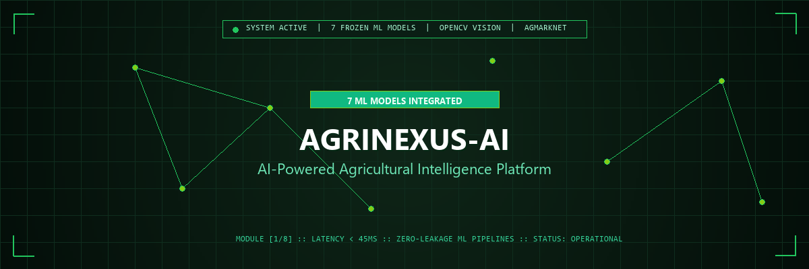
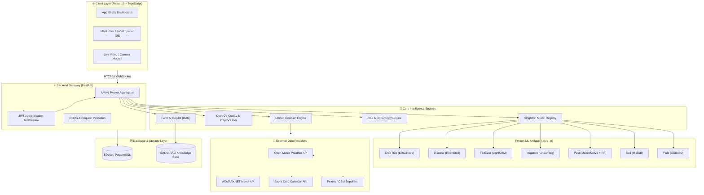
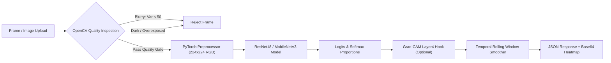
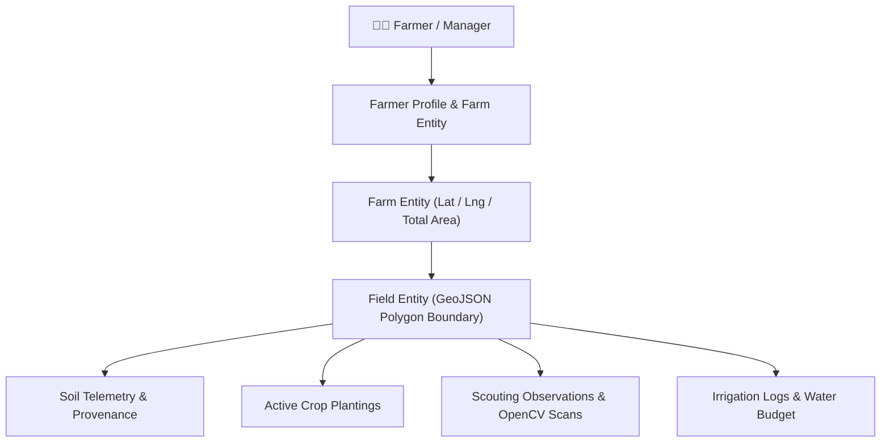

<p align="center">
  
</p>

<p align="center">
  
</p>

<h1 align="center">🌱 AgriNexus-AI</h1>

<p align="center">
  <strong>AI-Powered Agricultural Intelligence Platform for Smarter Farming Decisions</strong>
</p>

<p align="center">
  A state-of-the-art agricultural intelligence system integrating <strong>7 Frozen ML Model Artifacts</strong> across 8 inference tasks, <strong>Live OpenCV Computer Vision</strong> with visual explainability (Grad-CAM), <strong>Spatial GIS Field Command Center</strong>, <strong>AGMARKNET Mandi Market Forecasting</strong>, <strong>Open-Meteo Weather Telemetry</strong>, and a <strong>RAG-Powered AI Farming Copilot</strong>.
</p>

<p align="center">
  <a href="#-core-capabilities"></a>
  <a href="https://python.org"></a>
  <a href="https://fastapi.tiangolo.com"></a>
  <a href="https://pytorch.org"></a>
  <a href="https://scikit-learn.org"></a>
  <a href="https://opencv.org"></a>
  <a href="https://react.dev"></a>
  <a href="https://typescriptlang.org"></a>
  <a href="#-license"></a>
</p>

<p align="center">
  <a href="#-project-overview"><strong>Overview</strong></a> •
  <a href="#-core-capabilities"><strong>Capabilities</strong></a> •
  <a href="#-system-architecture"><strong>Architecture</strong></a> •
  <a href="#-ml-model-registry--performance"><strong>ML Models</strong></a> •
  <a href="#-real-time-data-flows"><strong>Data Flows</strong></a> •
  <a href="#-database-architecture"><strong>Database</strong></a> •
  <a href="#-installation--setup"><strong>Setup Guide</strong></a> •
  <a href="#-api-documentation"><strong>API Specs</strong></a> •
  <a href="#-known-limitations"><strong>Limitations</strong></a>
</p>

---

## 📋 Table of Contents

- [🌱 AgriNexus-AI](#-agrinexus-ai)
  - [📋 Table of Contents](#-table-of-contents)
  - [📌 Project Overview](#-project-overview)
    - [The Challenge](#the-challenge)
    - [The AgriNexus-AI Solution](#the-agrinexus-ai-solution)
  - [⚡ Core Capabilities & Feature Matrix](#-core-capabilities--feature-matrix)
  - [🧠 ML Model Registry \& Performance](#-ml-model-registry--performance)
    - [Verified Model Audit Summary](#verified-model-audit-summary)
    - [Detailed Model Specification Breakdown](#detailed-model-specification-breakdown)
      - [1. Crop Recommendation Engine (`crop_recommendation.pkl`)](#1-crop-recommendation-engine-crop_recommendationpkl)
      - [2. Plant Disease Detection (`disease_detection.pt`)](#2-plant-disease-detection-disease_detectionpt)
      - [3. Commercial Fertilizer Recommendation (`fertilizer_recommendation.pkl`)](#3-commercial-fertilizer-recommendation-fertilizer_recommendationpkl)
      - [4. Smart Irrigation Forecasting (`irrigation_prediction.pkl`)](#4-smart-irrigation-forecasting-irrigation_predictionpkl)
      - [5. Visual Pest Classification \& Environmental Risk (`pest_prediction.pkl`)](#5-visual-pest-classification--environmental-risk-pest_predictionpkl)
      - [6. Soil Organic Carbon Analysis (`soil_analysis.pkl`)](#6-soil-organic-carbon-analysis-soil_analysispkl)
      - [7. Crop Yield Forecasting (`yield_prediction.pkl`)](#7-crop-yield-forecasting-yield_predictionpkl)
  - [🏗️ System Architecture](#️-system-architecture)
    - [High-Level System Topology](#high-level-system-topology)
    - [ML Quality Gate \& Computer Vision Pipeline](#ml-quality-gate--computer-vision-pipeline)
    - [Farmer Command Center \& Geospatial Engine](#farmer-command-center--geospatial-engine)
  - [🔄 Real-Time Data Flows](#-real-time-data-flows)
    - [Standard Feature Inference Data Flow](#standard-feature-inference-data-flow)
    - [Live OpenCV Computer Vision Flow](#live-opencv-computer-vision-flow)
    - [AGMARKNET Market Forecasting Flow](#agmarknet-market-forecasting-flow)
  - [🗄️ Database Architecture](#️-database-architecture)
  - [🛠️ Technology Stack](#️-technology-stack)
  - [📂 Directory Structure](#-directory-structure)
  - [🚀 Installation \& Setup Guide](#-installation--setup-guide)
    - [Prerequisites](#prerequisites)
    - [1. Backend Setup](#1-backend-setup)
    - [2. Frontend Setup](#2-frontend-setup)
    - [3. Running the Platform](#3-running-the-platform)
    - [4. Verification \& Automated Testing](#4-verification--automated-testing)
  - [🔑 Environment Variables](#-environment-variables)
  - [📡 API Documentation](#-api-documentation)
    - [Core ML Inference Endpoints (`/api/v1`)](#core-ml-inference-endpoints-apiv1)
    - [Telemetry \& Intelligence Endpoints (`/api`)](#telemetry--intelligence-endpoints-api)
  - [⚠️ Known Limitations](#️-known-limitations)
  - [🛣️ Future Roadmap](#️-future-roadmap)
  - [🤝 Contributing](#-contributing)
  - [📜 License](#-license)
  - [👨‍💻 Author](#-author)

---

## 📌 Project Overview

### The Challenge
Smallholder farmers and agricultural enterprise managers face multi-faceted operational risks every season:
- **Agronomic Uncertainty:** Suboptimal crop selection leading to poor soil-nutrient matching and yield loss.
- **Disease & Pest Vulnerability:** Late diagnostic detection of crop pathologies causing catastrophic harvest devastation.
- **Water & Fertilizer Inefficiency:** Misaligned irrigation intervals and improper fertilizer formulation application degrading topsoil health.
- **Market Price Volatility:** Unpredictable Mandi price fluctuations leading to post-harvest revenue loss.

### The AgriNexus-AI Solution
**AgriNexus-AI** bridges the gap between machine learning research and real-world farm management. The platform aggregates **7 frozen machine learning models**, **OpenCV real-time computer vision**, **spatial GIS field mapping**, **live weather telemetry**, and **AGMARKNET commodity pricing** into a unified, actionable Farm Command Center.

> [!IMPORTANT]
> **Audit Guarantee:** All machine learning performance metrics, model contracts, datasets, and API endpoints documented in this repository are derived strictly from empirical evaluation logs and frozen artifacts. No metrics or capabilities are fabricated.

---

## ⚡ Core Capabilities & Feature Matrix

The following table documents the implementation state of all core feature modules within AgriNexus-AI:

| Feature Module | AI / Core Technology | Backend Service / Endpoint | Frontend Interface | Implementation Status |
| :--- | :--- | :--- | :--- | :---: |
| **Crop Recommendation** | ExtraTrees Classifier + IsolationForest | `POST /api/v1/crop/predict` | `CropPage.tsx` | `Implemented` |
| **Plant Disease Detection** | ResNet18 PyTorch + Grad-CAM | `POST /api/v1/disease/predict` | `DiseasePage.tsx` | `Implemented` |
| **Fertilizer Recommendation** | LightGBM Classifier Pipeline | `POST /api/v1/fertilizer/predict` | `FertilizerPage.tsx` | `Implemented` |
| **Irrigation Forecasting** | Linear Regression + SWC Baseline | `POST /api/v1/irrigation/predict` | `IrrigationPage.tsx` | `Implemented` |
| **Visual Pest Recognition** | MobileNetV3 Small (102 Classes) | `POST /api/v1/pest/predict/visual` | `PestPage.tsx` | `Implemented` |
| **Environmental Pest Risk** | Random Forest Risk Classifier | `POST /api/v1/pest/predict/risk` | `PestPage.tsx` | `Implemented` |
| **Soil Organic Carbon (SOC)** | HistGradientBoosting Regressor | `POST /api/v1/soil/predict` | `SoilPage.tsx` | `Implemented` |
| **Crop Yield Prediction** | XGBoost Regressor | `POST /api/v1/yield/predict` | `YieldPage.tsx` | `Implemented` |
| **AI Field Scanner (Live CV)** | OpenCV Quality Gate + WebSockets | `WS /api/v1/live/stream` | `LiveCameraPage.tsx` | `Implemented` |
| **Weather Telemetry** | Open-Meteo API + GDD / $ET_0$ | `GET /api/weather/forecast` | `WeatherPage.tsx` | `Implemented` |
| **Market Mandi Forecasting** | AGMARKNET + ARIMA / ETS | `GET /api/market/forecast` | `MarketPage.tsx` | `Implemented` |
| **Crop Calendar Engine** | Spora API + Local Reference Data | `GET /api/crop-calendar/schedule`| `CropCalendarPage.tsx` | `Implemented` |
| **Farmer Command Center** | Spatial GIS + GeoJSON Field Engine | `GET /api/v1/farmer/farms` | `ProfilePage.tsx` | `Implemented` |
| **AI Farming Copilot (RAG)** | SentenceTransformers + SQLite RAG | `POST /api/v1/assistant/chat` | `FarmAICopilot.tsx` | `Implemented` |

---

## 🧠 ML Model Registry & Performance

All 7 machine learning model artifacts are managed by a **Singleton Model Registry** (`app/services/model_registry.py`) that initializes artifacts once at startup, executes deterministic smoke tests, and exposes thread-safe inference services.

### Verified Model Audit Summary

| Module | Model Architecture | Task | Dataset | Primary Metric | Validation Scope | Readiness |
| :--- | :--- | :--- | :--- | :--- | :--- | :---: |
| **Crop Recommendation** | ExtraTrees Classifier | Multi-Class Crop Selection (22 Classes) | `Crop_recommendation.csv` (2,200 rows) | **Val Macro F1: 0.9970**<br/>Test Acc: 98.79% | Ideal Soil & Climate Features | `PASS` |
| **Disease Detection** | Pretrained ResNet18 | 39 Plant Leaf Diseases | PlantVillage (116k images) + PlantWild v2 | **In-Domain Test Acc: 96.21%**<br/>Top-3 Acc: 99.59% | Controlled Studio & Field | `PASS` |
| **Fertilizer Recommendation**| LightGBM Pipeline | 19 Fertilizer Formulations | Western Maharashtra Survey (4,513 rows) | **Val Macro F1: 0.8633**<br/>Test Acc: 93.50% | Regional Soil Formulations | `PASS` |
| **Irrigation Prediction** | Linear Regression | 3-Hour Soil Water Content ($m^3/m^3$) | Gallipoli Sensor Series (14,588 rows) | **Test MAE: 0.000519**<br/>Persistence: 0.000311 | High Moisture Persistence | `CONDITIONAL` |
| **Pest Recognition** | MobileNetV3 Small (Visual) + Random Forest (Env) | 102 Visual Insect Pests + Env Severity Risk | IP102 (75k images) & `pest_data.csv` (1k rows) | **Visual Top-1 Acc: 29.51%**<br/>Env Test Acc: 96.00% | CPU Benchmark / Env Risk | `CONDITIONAL` |
| **Soil Analysis** | HistGradientBoosting | Soil Organic Carbon ($g/kg$) | LUCAS EU Topsoil Survey (21,859 rows) | **Held-Out Test $R^2$: 0.9610**<br/>Test MAE: 6.33 g/kg | European Union Topsoil | `PASS` |
| **Yield Prediction** | XGBoost Regressor | Annual Crop Yield | Indian Yield Survey (19,689 rows) | **Held-Out Test $R^2$: 0.9529**<br/>Test MAE: 13.82 | Chronological (1997–2020) | `PASS` |

---

### Detailed Model Specification Breakdown

#### 1. Crop Recommendation Engine (`crop_recommendation.pkl`)
- **Algorithm:** ExtraTrees Classifier paired with an IsolationForest anomaly detector.
- **Dataset:** `Crop_recommendation.csv` (2,200 observations; 1,540 train / 330 val / 330 test).
- **Target Variable:** 22 crop classes (`apple`, `banana`, `blackgram`, `chickpea`, `coconut`, `coffee`, `cotton`, `jute`, `kidneybeans`, `lentil`, `maize`, `mango`, `mothbeans`, `mungbean`, `muskmelon`, `orange`, `papaya`, `pigeonpeas`, `pomegranate`, `rice`, `watermelon`).
- **Input Features (7):** `N`, `P`, `K`, `temperature`, `humidity`, `ph`, `rainfall`.
- **Contract Requirement:** Model expects **raw unscaled input features**. Inputs are passed directly to ExtraTrees without standard scaling.
- **Out-of-Distribution Handling:** IsolationForest flags inputs with out-of-distribution values to prevent implausible agricultural recommendations.

#### 2. Plant Disease Detection (`disease_detection.pt`)
- **Algorithm:** Transfer Learning with PyTorch ResNet18 backbone.
- **Dataset:** PlantVillage studio dataset + PlantWild v2 field dataset (116,934 images across 39 classes).
- **Input Specifications:** $224 \times 224 \times 3$ RGB image tensor, normalized with ImageNet mean `[0.485, 0.456, 0.406]` and std `[0.229, 0.224, 0.225]`.
- **Visual Explainability:** Integrated Grad-CAM hook attached to `layer4[-1]` generating visual heatmaps for spatial diagnosis verification.
- **Domain Shift Audit:** Studio validation achieves 96.21% accuracy; field evaluation highlights studio-to-field domain adaptation shift.

#### 3. Commercial Fertilizer Recommendation (`fertilizer_recommendation.pkl`)
- **Algorithm:** ColumnTransformer Preprocessing + LightGBM Classifier Pipeline.
- **Dataset:** Western Maharashtra Crop & Soil Survey (4,513 observations across 19 formulations).
- **Input Features (10):** `Nitrogen`, `Phosphorus`, `Potassium`, `pH`, `Rainfall`, `Temperature`, `District_Name`, `Soil_color`, `Crop`, `Link`.
- **Regional Limitation:** Validated on Western Maharashtra soil characteristics; out-of-region deployments trigger an explicit scope warning.

#### 4. Smart Irrigation Forecasting (`irrigation_prediction.pkl`)
- **Algorithm:** Linear Regression with StandardScaler.
- **Dataset:** Gallipoli Sensor Time-Series (`SoilWaterContent.xlsx` & `porta1_meteo_piogge.xlsx`, 14,588 hourly readings).
- **Target Variable:** 3-Hour-Ahead Soil Water Content ($SWC_{t+3h}$, $m^3/m^3$).
- **Benchmark Distinction:** Persistence baseline ($SWC_{t+3h} = SWC_t$) yields Test MAE of 0.000311 $m^3/m^3$ due to high temporal autocorrelation. The decision engine evaluates ML predictions against agronomic threshold limits:
  - **Field Capacity ($FC$):** 0.320 $m^3/m^3$
  - **Critical Depletion Threshold:** 0.230 $m^3/m^3$
  - **Wilting Point ($WP$):** 0.140 $m^3/m^3$

#### 5. Visual Pest Classification & Environmental Risk (`pest_prediction.pkl`)
- **Task A (Visual Classification):** Pretrained MobileNetV3 Small on 102 insect pest classes from the IP102 dataset (Resource-constrained benchmark Top-1 accuracy: 29.51%; Top-5: 56.67%).
- **Task B (Environmental Risk):** RandomForestClassifier on `pest_data.csv` predicting outbreak risk level (`Low`, `Medium`, `High`) with 96.00% accuracy.
- **Scope Note:** Visual pest classifier performs fine-grained insect classification; it does not perform bounding-box object detection.

#### 6. Soil Organic Carbon Analysis (`soil_analysis.pkl`)
- **Algorithm:** HistGradientBoosting Regressor with GroupShuffleSplit partitioning on NUTS_2 administrative regions (zero spatial overlap).
- **Dataset:** LUCAS Topsoil 2015 European Survey (21,859 observations across 259 NUTS_2 regions).
- **Target Variable:** Soil Organic Carbon (SOC) in $g/kg$.
- **Performance:** Test $R^2 = 0.9610$, Test MAE = 6.3331 g/kg, Test MedAE = 2.7198 g/kg.
- **Uncertainty Interval:** Empirical 95th percentile residual margin of $\pm 38.72$ g/kg (97.43% test coverage).

#### 7. Crop Yield Forecasting (`yield_prediction.pkl`)
- **Algorithm:** XGBoost Regressor with Chronological Out-of-Time split (Train: 1997–2015, Val: 2016–2017, Test: 2018–2020).
- **Dataset:** Indian Crop Yield Dataset (19,689 observations across 9 features).
- **Target Unit Note:** Target yield values reflect heterogeneous crop measurement conventions (e.g. Tonnes, Bales, or Nuts per Hectare).
- **Performance:** Test $R^2 = 0.9529$, Test MAE = 13.8243, Test RMSE = 184.1554. Empirical 95% interval margin: $\pm 7.975$.

---

## 🏗️ System Architecture

### High-Level System Topology



---

### ML Quality Gate & Computer Vision Pipeline



---

### Farmer Command Center & Geospatial Engine



---

## 🔄 Real-Time Data Flows

### Standard Feature Inference Data Flow

```text
Farmer Input (N, P, K, pH, Rainfall, Temp)
  ↓
Request Validation (Pydantic Schema)
  ↓
IsolationForest Out-of-Distribution Check
  ↓
ExtraTrees Unscaled Feature Inference
  ↓
Probability Ranking & Top-K Extraction
  ↓
Response JSON (Crop Label, Confidence, Top-3 Array)
  ↓
Frontend Visualization (Recharts + Recommendation Card)
```

---

### Live OpenCV Computer Vision Flow

```text
Webcam Stream / File Input
  ↓
OpenCV Frame Extraction & Laplacian Blur Variance Check
  ↓
Mean Brightness Exposure Audit (30.0 - 225.0)
  ↓
PyTorch Tensor Normalization (ImageNet Standards)
  ↓
ResNet18 / MobileNetV3 Inference
  ↓
Grad-CAM Feature Map Backward Pass (layer4[-1])
  ↓
Temporal Rolling Smoother Buffer (Window Size = 5)
  ↓
WebSocket / REST Stream Broadcast to Live Camera Page
```

---

### AGMARKNET Mandi Market Forecasting Flow

```text
Scheduled / User Trigger
  ↓
AGMARKNET API Request (data.gov.in)
  ↓
Commodity Name Canonicalization
  ↓
SQLite Database Storage (market_observations)
  ↓
Statsmodels Time-Series Engine (ARIMA / Holt-Winters ETS)
  ↓
Confidence Interval Calculation (Min / Max / Modal Price)
  ↓
Market Insights & Forecast Chart Rendering
```

---

## 🗄️ Database Architecture

The SQLite/PostgreSQL relational database contains **17 core entities**:

1. `users` — Authentication identity, hashed passwords, ownership root.
2. `farmer_profiles` — Personal details, preferred language, timezone, units.
3. `farms` — Farm boundaries, latitude/longitude, total area in $m^2$, water source.
4. `fields` — GeoJSON field polygons, perimeter, centroid, soil parameters with provenance (`MEASURED`, `ESTIMATED`, `UNKNOWN`).
5. `plant_observations` — Scouting records, disease/pest findings, attached photo analysis.
6. `action_item_records` — Personalized farmer action items prioritized by urgency.
7. `alert_notification_records` — Proactive smart alerts with fingerprint deduplication.
8. `notification_preference_records` — Channel options (In-App, Email, SMS, WhatsApp) and quiet hours.
9. `notification_delivery_records` — Delivery logs across messaging providers.
10. `crop_plantings` — Active cultivations, growth stage, sowing and harvest dates.
11. `market_observations` — AGMARKNET daily market prices (min, max, modal).
12. `forecast_results` — Market price forecast cache and accuracy metrics.
13. `irrigation_logs` — Logged irrigation events, applied water volume ($mm$, liters).
14. `farming_knowledge_records` — RAG QA knowledge base with precomputed embeddings.
15. `conversations` — AI Farming Copilot persistent chat sessions.
16. `messages` — Chat messages, tool calls, actions, and source citations.
17. `farm_activity_events` — Historical audit trail for farm actions.

---

## 🛠️ Technology Stack

- **Machine Learning:** PyTorch, Scikit-Learn (v1.7.1), LightGBM, XGBoost, Statsmodels, Joblib.
- **Computer Vision:** OpenCV (`opencv-python-headless`), Pillow, Grad-CAM.
- **Backend Framework:** FastAPI, Uvicorn, Pydantic v2, Python-Dotenv, PyTest.
- **Database & ORM:** SQLite / PostgreSQL, SQLAlchemy 2.0, Alembic migrations.
- **Frontend Framework:** React 19, TypeScript 6.0, Vite, React Router v7, TailwindCSS v4.
- **Data Visualization & GIS:** Recharts, Lucide React, GeoJSON.
- **External Telemetry:** Open-Meteo Weather API, AGMARKNET (data.gov.in), Spora Crop Calendar API, Overpass OSM / Google Places API.

---

## 📂 Directory Structure

```
AGRINEXUS-AI/
├── assets/                          # Generated project visual assets
│   ├── agrinexus-banner.gif         # Premium animated project banner
│   ├── agrinexus-banner-static.png  # Static fallback banner
│   ├── logo.png                     # High-resolution PNG logo
│   └── logo.svg                     # Vector SVG logo
├── backend/                         # FastAPI Master Backend
│   ├── app/
│   │   ├── api/                     # API routes (v1 ML/CV + telemetry)
│   │   ├── core/                    # Config, security, logging
│   │   ├── database/                # SQLAlchemy models & SQLite repository
│   │   ├── forecasting/             # ARIMA / ETS time-series engine
│   │   ├── intelligence/            # Decision Engine & Risk matrix
│   │   ├── schemas/                 # Pydantic validation contracts
│   │   ├── services/                # ModelRegistry, CV, RAG assistant
│   │   └── main.py                  # Application entry point & lifespan
│   ├── data/                        # Local SQLite databases & knowledge base
│   ├── requirements.txt             # Python dependencies
│   └── tests/                       # PyTest automated integration test suite
├── frontend/                        # React + TypeScript Frontend
│   ├── src/
│   │   ├── components/              # UI components, Copilot, layout
│   │   ├── context/                 # Auth, Health, Location, Profile state
│   │   ├── pages/                   # Feature dashboards & ML tool pages
│   │   └── services/                # API client services
│   ├── package.json                 # Node dependencies
│   └── vite.config.ts               # Vite build configuration
├── models/                          # Frozen ML Model Artifacts (.pkl, .pt)
├── Notebook/                        # 7 Master Jupyter Notebooks & Audit Reports
│   ├── 01_crop_recommendation.ipynb
│   ├── 02_plant_disease_detection.ipynb
│   ├── 03_fertilizer_recommendation.ipynb
│   ├── 04_irrigation_prediction.ipynb
│   ├── 05_pest_prediction.ipynb
│   ├── 06_soil_analysis.ipynb
│   └── 07_yield_prediction.ipynb
└── docs/                            # Agronomic & Architecture Documentation
```

---

## 🚀 Installation & Setup Guide

### Prerequisites
- **Python:** Version 3.13+
- **Node.js:** Version 20.0+ & `npm`
- **Git:** Version 2.30+

---

### 1. Backend Setup

```bash
# Navigate to backend directory
cd backend

# Create virtual environment
python -m venv .venv

# Activate virtual environment
# Windows (PowerShell):
.venv\Scripts\Activate.ps1
# Linux / macOS:
source .venv/bin/activate

# Install dependencies
pip install -r requirements.txt
```

Verify that all 7 frozen model artifacts exist in `models/` or `Notebook/models/`:
- `crop_recommendation.pkl`
- `disease_detection.pt`
- `fertilizer_recommendation.pkl`
- `irrigation_prediction.pkl`
- `pest_prediction.pkl`
- `soil_analysis.pkl`
- `yield_prediction.pkl`

---

### 2. Frontend Setup

```bash
# Navigate to frontend directory
cd ../frontend

# Install dependencies
npm install
```

---

### 3. Running the Platform

#### Terminal 1: Backend Server
```bash
cd backend
python -m uvicorn app.main:app --reload --host 0.0.0.0 --port 8000
```
*Backend Swagger API Documentation will be available at:* `http://localhost:8000/docs`

#### Terminal 2: Frontend Client
```bash
cd frontend
npm run dev
```
*Frontend Application will be available at:* `http://localhost:5173`

---

### 4. Verification & Automated Testing

Run the full backend automated test suite:
```bash
cd backend
pytest -v
```

Execute frontend linting and type checking:
```bash
cd frontend
npm run lint
npm run build
```

---

## 🔑 Environment Variables

Create a `backend/.env` file in the `backend/` directory:

```env
# API & Server Configuration
PROJECT_NAME="AgriNexus-AI"
VERSION="1.0.0"
HOST="0.0.0.0"
PORT=8000
DEBUG=False
CORS_ORIGINS=["*"]

# Database Connection
DATABASE_URL="sqlite:///./data/market/market_data.db"

# External Telemetry API Keys
DATA_GOV_API_KEY="your_data_gov_in_api_key_here"
PEXELS_API_KEY="your_pexels_api_key_here"
SPORA_API_KEY="your_spora_api_key_here"
GOOGLE_PLACES_API_KEY="your_google_places_api_key_here"

# Computer Vision Quality Thresholds
CV_BLUR_THRESHOLD=50.0
CV_BRIGHTNESS_LOW=30.0
CV_BRIGHTNESS_HIGH=225.0
```

---

## 📡 API Documentation

### Core ML Inference Endpoints (`/api/v1`)

| Method | Endpoint | Description | Payload Example |
| :--- | :--- | :--- | :--- |
| `GET` | `/api/v1/health` | Model registry health & artifact status | None |
| `POST` | `/api/v1/crop/predict` | Crop recommendation inference | `{"N": 90, "P": 42, "K": 43, "temperature": 20.8, "humidity": 82.0, "ph": 6.5, "rainfall": 202.9}` |
| `POST` | `/api/v1/disease/predict` | Plant disease image diagnosis | `multipart/form-data` image upload (`include_gradcam=true`) |
| `POST` | `/api/v1/fertilizer/predict` | Fertilizer formulation recommendation | `{"Nitrogen": 37, "Phosphorus": 20, "Potassium": 20, "pH": 6.5, "Rainfall": 120, "Temperature": 26, "District_Name": "Pune", "Soil_color": "Black", "Crop": "Rice"}` |
| `POST` | `/api/v1/irrigation/predict` | 3-hour soil water content forecast | `{"SWC": 0.22, "SWC_lag1h": 0.225, "SWC_lag2h": 0.23, "SWC_lag3h": 0.235, "SWC_roll6h_mean": 0.23, "Rainfall_mm": 0.0, "Rain_roll6h_sum": 0.0}` |
| `POST` | `/api/v1/pest/predict/visual` | 102 insect species visual recognition | `multipart/form-data` image upload |
| `POST` | `/api/v1/pest/predict/risk` | Environmental pest risk level | `{"Temperature": 28.5, "Humidity": 75.0, "Rainfall": 120.0, "Crop_Type": "Rice", "Soil_Type": "Clay", "Region": "South"}` |
| `POST` | `/api/v1/soil/predict` | Soil Organic Carbon estimation | `{"pH(CaCl2)": 6.2, "pH(H2O)": 6.8, "Clay": 25.0, "Silt": 40.0, "Sand": 35.0, "CaCO3": 12.0, "P": 18.5, "N": 2.1, "K": 180.0, "EC": 15.0, "NUTS_0": "DE", "LC1": "B11"}` |
| `POST` | `/api/v1/yield/predict` | Annual crop yield forecasting | `{"Crop": "Rice", "Season": "Kharif", "State": "Punjab", "Area": 100.0, "Annual_Rainfall": 1200.0, "Fertilizer": 15000.0, "Pesticide": 500.0, "Fertilizer_Per_Area": 150.0, "Pesticide_Per_Area": 5.0}` |
| `WS` | `/api/v1/live/stream` | Real-time camera streaming scanner | WebSocket binary frame stream |

---

### Telemetry & Intelligence Endpoints (`/api`)

| Method | Endpoint | Description |
| :--- | :--- | :--- |
| `GET` | `/api/weather/forecast` | Open-Meteo 7-day weather telemetry & GDD |
| `GET` | `/api/market/forecast` | Mandi commodity price history & ARIMA forecasts |
| `GET` | `/api/crop-calendar/schedule` | Crop growth stage schedule & harvest windows |
| `POST` | `/api/v1/assistant/chat` | RAG AI Farming Copilot query endpoint |

---

## ⚠️ Known Limitations

1. **Gallipoli Soil Moisture Autocorrelation:** The Gallipoli sensor dataset exhibits high temporal persistence in soil moisture, making a simple persistence baseline ($SWC_{t+3h} = SWC_t$) highly competitive with linear regression.
2. **Controlled Studio Visual Shift:** Plant disease detection was trained primarily on PlantVillage laboratory studio images; outdoor field images may exhibit background noise domain shift.
3. **Regional Fertilizer Model Scope:** The fertilizer recommendation model was trained on Western Maharashtra crop survey data and requires domain calibration for out-of-region soils.
4. **Visual Pest CPU Benchmark:** The fine-grained 102-class visual insect classifier was evaluated on a CPU benchmark subset (Top-1 accuracy 29.51%); full field deployment requires GPU fine-tuning across all 45,095 images.
5. **LUCAS Soil Model Domain:** Soil Organic Carbon analysis was trained on European LUCAS topsoil data; local calibration is required for tropical Indian topsoils.

---

## 🛣️ Future Roadmap

- [ ] **Edge ML Deployment:** Quantize PyTorch ResNet18 and MobileNetV3 models to ONNX WebAssembly format for client-side offline execution.
- [ ] **Hyperspectral Drone Vision:** Integrate Multispectral / NDVI GeoTIFF raster file processing into the Farmer Command Center.
- [ ] **Multi-Lingual Voice Copilot:** Add Web Speech API speech-to-text integration for voice-driven regional language queries (Hindi, Marathi, Telugu, Tamil).

---

## 🤝 Contributing

Contributions are welcome! Please follow these steps:
1. Fork the repository.
2. Create a feature branch: `git checkout -b feature/agronomic-enhancement`.
3. Commit your changes: `git commit -m "Add agronomic feature"`.
4. Run tests: `pytest backend/tests`.
5. Push to the branch: `git push origin feature/agronomic-enhancement`.
6. Open a Pull Request.

---

## 📜 License

Distributed under the **MIT License**. See `LICENSE` for details.

---

## 👨‍💻 Author

**AgriNexus-AI Engineering Team**  
*Building intelligent, open, and resilient agricultural technology.*
