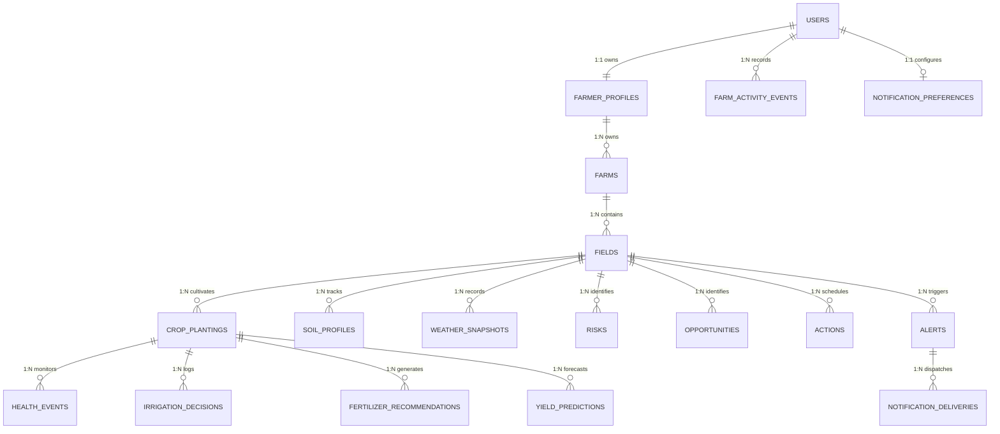

# AgriNexus-AI Database & Persistence Architecture

## 1. Executive Summary & Architectural Overview

AgriNexus-AI uses a relational database model (SQLite for development, PostgreSQL for production) as the **single source of truth** for all user-owned persistent entities, farm configurations, crop lifecycles, and historical intelligence.

### Key Guarantees
1. **Permanent User Identity**: Every registered user receives a permanent database-generated UUID (`users.id`). User identities remain unchanged across login, logout, browser refreshes, device restarts, and backend restarts.
2. **Server-Side Hydration**: The frontend hydrates state exclusively from `/api/v1/farmer/...` endpoints using JWT Bearer authentication headers. No critical farm business data exists solely in React state or `localStorage`.
3. **Strict Cross-User Isolation**: Every database operation verifies entity ownership via `get_current_user`. User B can never read, modify, or delete User A's farms, fields, crops, risks, or activity records.
4. **Non-Destructive Schema Initialization**: Database initialization uses safe column-checking (`Base.metadata.create_all`). Production/startup logic NEVER calls `Base.metadata.drop_all()`.
5. **Degraded External Intelligence Handling**: External API outages (Weather, Market, Soil services) degrade gracefully without throwing 500 errors or failing database queries.

---

## 2. Entity-Relationship (ER) Diagram

---

## 3. Relational Table Schemas & Constraints

### 3.1 `users`
- **`id`** (`String(36)`, Primary Key, UUIDv4): Permanent user identifier.
- **`email`** (`String(150)`, Unique, Indexed, Not Null): Canonical user login email.
- **`password_hash`** (`String(255)`, Not Null): Standard library PBKDF2-HMAC-SHA256 hash string (format: `pbkdf2:sha256:100000$<salt>$<hash>`).
- **`full_name`** (`String(150)`, Not Null): Registered name.
- **`created_at`** / **`updated_at`** (`DateTime`, UTC): Timestamps.

### 3.2 `farmer_profiles`
- **`id`** (`Integer`, Primary Key, Autoincrement): Internal profile ID.
- **`user_id`** (`String(36)`, Foreign Key -> `users.id` `ON DELETE CASCADE`, Unique, Not Null, Indexed): Link to user entity.
- **`full_name`** (`String(150)`, Not Null): Farmer name.
- **`phone`** (`String(30)`): Optional phone number.
- **`email`** (`String(150)`): Contact email.
- **`preferred_language`** (`String(20)`, Default `'en'`): Localization preference.
- **`created_at`** / **`updated_at`** (`DateTime`, UTC): Timestamps.

### 3.3 `farms`
- **`id`** (`Integer`, Primary Key, Autoincrement): Farm ID.
- **`farmer_id`** (`Integer`, Foreign Key -> `farmer_profiles.id` `ON DELETE CASCADE`, Not Null, Indexed): Owner profile.
- **`farm_name`** (`String(150)`, Not Null): Human-readable farm title.
- **`latitude`** / **`longitude`** (`Float`, Not Null): Centroid coordinates.
- **`area_value`** (`Float`, Not Null) & **`area_unit`** (`String(30)`): Input area.
- **`total_area_m2`** (`Float`, Not Null): Normalized land area in $m^2$.
- **`created_at`** / **`updated_at`** (`DateTime`, UTC): Timestamps.

### 3.4 `fields`
- **`id`** (`Integer`, Primary Key, Autoincrement): Field ID.
- **`farm_id`** (`Integer`, Foreign Key -> `farms.id` `ON DELETE CASCADE`, Not Null, Indexed): Parent farm.
- **`field_name`** (`String(150)`, Not Null): Field title.
- **`area_value`** / **`area_unit`** / **`total_area_m2`**: Normalized field size.
- **`boundary_geojson`** (`Text`): GeoJSON polygon representation (persistently saved geometry).
- **`centroid_lat`** / **`centroid_lng`** (`Float`): Polygon centroid.
- **`created_at`** / **`updated_at`** (`DateTime`, UTC): Timestamps.

### 3.5 `crop_plantings`
- **`id`** (`Integer`, Primary Key, Autoincrement): Crop ID.
- **`field_id`** (`Integer`, Foreign Key -> `fields.id` `ON DELETE CASCADE`, Not Null, Indexed): Parent field.
- **`crop_name`** (`String(100)`, Not Null): Crop species (e.g., Rice, Wheat).
- **`growth_stage`** (`String(50)`): Current stage (e.g., Vegetative, Flowering).
- **`status`** (`String(50)`, Default `'ACTIVE'`): Crop state (`ACTIVE`, `HARVESTED`, `FAILED`).
- **`planting_date`** (`Date`): Planting start date.
- **`expected_harvest_date`** (`Date`): Projected harvest date.
- **`created_at`** / **`updated_at`** (`DateTime`, UTC): Timestamps.

### 3.6 `farm_activity_events`
- **`id`** (`Integer`, Primary Key, Autoincrement): Event ID.
- **`user_id`** (`String(36)`, Foreign Key -> `users.id` `ON DELETE CASCADE`, Not Null, Indexed): Owning user.
- **`farm_id`** (`Integer`, Foreign Key -> `farms.id` `ON DELETE CASCADE`, Optional): Context farm.
- **`field_id`** (`Integer`, Foreign Key -> `fields.id` `ON DELETE SET NULL`, Optional): Context field.
- **`crop_id`** (`Integer`, Foreign Key -> `crop_plantings.id` `ON DELETE SET NULL`, Optional): Context crop.
- **`event_type`** (`String(50)`, Not Null): Type (e.g., `FARM_CREATED`, `FIELD_CREATED`, `CROP_ADDED`, `ACTION_COMPLETED`).
- **`title`** (`String(250)`, Not Null) & **`description`** (`Text`): Human-readable activity summary.
- **`metadata_json`** (`Text`): JSON payload for extended telemetry.
- **`created_at`** (`DateTime`, UTC): Activity timestamp.

---

## 4. Authentication Mapping & Authorization Rules

1. **JWT Session Lifecycle**:
   - `/api/v1/auth/register` creates `User` and `FarmerProfile` in a single database transaction.
   - `/api/v1/auth/login` verifies password hash using constant-time comparison and returns a signed HS256 JWT access token containing `{"sub": user.id}`.
   - Access tokens are transmitted in the `Authorization: Bearer <token>` header.
2. **`get_current_user` Dependency**:
   - Every protected API endpoint inspects the HTTP Bearer header, validates JWT signature and expiry, queries the `User` database table, and injects the authenticated `User` model.
   - If token is missing, expired, or invalid, returns HTTP 401 Unauthorized.
3. **Ownership Validation & Cascade Policies**:
   - All farm resources check `farm.farmer_id == farmer_profile.id` where `farmer_profile.user_id == current_user.id`.
   - Unauthorized requests return HTTP 404 Not Found to prevent resource enumeration attacks.

---

## 5. History, Timeline & Degraded State Resilience

- **Activity Timeline**: All meaningful state mutations (`POST /farms`, `POST /fields`, `POST /crops`, `PATCH /actions/{id}`) append records to `farm_activity_events` for longitudinal tracking.
- **External API Degraded State Rules**:
  - Outages in external market or weather APIs do not throw HTTP 500 errors.
  - In `FarmIntelligenceService`, external calls are wrapped in safe `try/except` handlers. On network failure, default fallbacks or cached database snapshots are rendered with `status="DEGRADED"` metadata.
